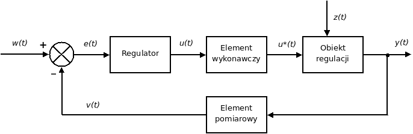

# Podstawy Automatyki I Sterowania

## Pytania do kolokwium 

### 1. Omów pojęcia: obiekt regulacji, urządzenie wykonawcze, zakłócenie, element pomiarowy - w tym narysować symbole. 

   Żródło [Wikipedia.org - Układ regulacji (automatyka)](https://pl.wikipedia.org/wiki/Uk%C5%82ad_regulacji_%28automatyka%29)

**Pojęcie**               | **Opis**
:-------------------------| :--------------------------------------------------------------------------------------------------------
**Obiekt regulacji**      | Urządzenie lub proces, na który oddziałują sygnały   nastawiające `u(t)` i zakłócające `z(t)`,  generując sygnały wyjściowe `y(t)`
**Urządzenie   wykonawcze** | Urządzenie wymuszające zmiany wielkości regulowanej,  składające się z elementu napędowego (np. siłownik)  i wykonawczego (np. zawór regulacyjny)
**Zakłócenie**            | Niekorzystny sygnał zewnętrzny `z(t)`,  to niepożądany czynnik, który powoduje   odchylenie wielkości regulowanej `y(t)`  od wartości zadanej `w(t)`
**Element   pomiarowy**     | Wykonuje pomiar wielkości regulowanej `y(t)`,  a następnie przekształca ją na sygnał `v(t)`  (opisywanego także jako ym) zrozumiałego   i gotowego do wprowadzenia do regulatora

### 2. Omów sposoby łączenia podstawowych bloków na schematach blokowych.

**Połączenie**          | **Opis danego połączonenia bloków** | **Transmisja wypadkowa**
------------------------|-------------------------------------|-----------------------------------
**Szeregowe (kaskadowe)** | Sygnał wyjściowy z pierwszego bloku   jest sygnałem wejściowym dla drugiego, i tak dalej   Informacja przepływa sekwencyjnie przez kolejne bloki | Iloczyn algebraiczny $G_w = G_1 \cdot G_2 \cdot \dots \cdot G_n$
**Równoległe**          | Ten sam sygnał wejściowy jest podawany   jednocześnie na wszystkie bloki składowe,   a ich sygnały wyjściowe są sumowane   algebraicznie w węźle sumacyjnym | Suma algebraliczna   $G_w = G_1 + G_2 + \dots + G_n$
**Ze sprzężeniem   zwrotnym** | Sygnał wyjściowy obiektu jest zwracany (sprzęgany)  i odejmowany lub dodawany do sygnału wejściowego,  tworząc zamkniętą pętlę regulacji | $G_w = \frac{G_1}{1 \pm G_1 \cdot G_2}$   dla sprzężenie zwrotnego `-`   dla sprzężenia dodatniego `+`

### 3. Omów na przykładzie różnice między regulacją ręczną i automatyczną 

 **Cecha   regulacji** | **Regulacja Ręczna   (Przykład: Zawór Grzejnikowy)** | **Regulacja Automatyczna   (Przykład: Termostat Grzejnikowy)** |
 :--- | :--- | :--- 
 **Pętla   sterowania** | Układ jest **otwarty**:   brak analizy sygnału wyjściowego   brak sprzężenia zwrotnego | Układ jest **zamknięty**:   proces odbywa się w obwodzie zamkniętym   układ sterowania ze **sprzężeniem zwrotnym** 
 **Przykład   urządzenia   wykonawczego** | Zawór grzejnikowy jest sterowany   **ręcznie** przez człowieka   (jako operatora) | Termostat grzejnikowy zawiera   **regulator** i **czujnik temperatury**,   który automatycznie steruje   temperaturą powietrza w pomieszczeniu 
 **Sterowanie** | **Ręcznie** przez człowieka,  który mierzy temperaturę   i porównuje ją z wartością zadaną (`w`),  a następnie ręcznie steruje   zaworem grzejnika | **Regulator** porównuje   wielkość regulowaną (`y`) z wartością zadaną (`w`),   a następnie zmienia sygnał sterujący (`u`),   dążąc do warunku równości `y=w` 
 **Reakcja na zakłócenia** | Wymaga **ponownego dostosowania**   zaworu przez człowieka   W przypadku zakłóceń (`z`)   układ nie będzie wykonywał zadania, dopóki operator nie zareaguje | Działanie układu ma na celu   **eliminowanie wpływu zakłóceń** (`z`)   na wielkość regulowaną   Układu jest stosunkowo niewrażliwa   na zewnętrzne zakłócenia 
 **Dokładność** | Jest **niska**,  zależna od uwagi i zmęczenia operatora;   człowiek może subiektywnie wpływać na proces | Ma na celu **minimalizację uchybu**  (to znaczy różnicy)   między wielkością regulowaną a zadaną,   zapewniając wymaganą jakość regulacji 

### 4. Omów metodę doświadczalną wyznaczania charakterystyk dynamicznych.

**Aspekt**  | **Opis** 
:---------- | :---------- 
**Kiedy   stosowana**  | W przypadku niedostatecznej wiedzy   o zjawiskach w obiekcie regulacji 
**Najczęstrza   metoda**    | **Charakterystyka Skokowa** 
**Stanowi** | Ocenę transmitancji obiektu na podstawie analizy   odpowiedzi obiektu na wymuszenie skokowe
**Umożliwia**    | Proste wyznaczenie  **współczynnika wzmocnienia, obiektu  statycznego** 
**Współczynnik** | $K = \frac{\Delta y}{\Delta u}$
 *gdzie* | $\Delta y$ - zmiana wartości ustalonej odpowiedzi skosowej obiektu   $\Delta u$ - zmiana wartości sygnału wejściowego

### 5. Scharakteryzuj i podaj przykład obiektu proporcjonalnego z opóźnieniem.

Aspekt | Opis |
:--- | :--- |
**Typ Obiektu** | Obiekt **statyczny (z samowyrównaniem)**   proporcjonalny z czystym opóźnieniem transportowym
**Odpowiedź   Dynamiczna** | Odpowiedź na wymuszenie skokowe jest **identyczna z wymuszeniem,  ale przesunięta w czasie** o wartość opóźnienia $T_t$   brak inercji, tylko czyste opóźnienie
**Czas Opóźnienia $T_t$** | Określa czas, po którym sygnał wyjściowy zaczyna reagować   wynik fizycznego transportu (np. przepływu medium, przesuwu taśmy)
**Transmitancja Operatorowa** | $$G(s) = K \cdot e^{-T_t \cdot s}$$ gdzie:  $K$ – współczynnik wzmocnienia (dla czystego opóźnienia często $K = 1$),  $e^{-T_t s}$– człon opóźniający (transportowy)
**Przykład 1** | **Przewód z mieszającym zaworem regulacyjnym   oraz czujnikiem temperatury** – sygnał temperatury dociera do czujnika   z opóźnieniem wynikającym z czasu przepływu medium
**Przykład 2** | **Taśmowy podajnik węgla**   grubość warstwy paliwa w odległości $l$ od początku podajnika powtarza   grubość na początku, ale z opóźnieniem $T = \frac{l}{v}$

### 6. Scharakteryzuj i podaj przykład obiektu inercyjnego pierwszego rzędu.

Aspekt | Opis 
:--- | :--- 
**Typ Obiektu** | Obiekt **statyczny** (z samowyrównaniem)
**Odpowiedź   Dynamiczna** | Odpowiedź na wymuszenie skokowe dąży **asymptotycznie do nowej,   skończonej wartości ustalonej** (bez opóźnienia transportowego)
**Stała Czasowa ($T$)** | Określa szybkość reakcji – jest to czas,  po którym wartość wyjściowa osiąga   63,2% wartości końcowej
**Transmitancja   Operatorowa** | $$G(s) = \frac{K}{T \cdot s + 1}$$ gdzie $K$ to współczynnik wzmocnienia,   $T$ to stała czasowa,   człon ${T \cdot s + 1}$ stanowi inercję
**Przykład** | **Podgrzewacz ciepłej wody** z trójdrogowym zaworem regulacyjnym

### 7. Scharakteryzuj regulatory dwustawne.

Aspekt | Opis
:--- | :---

### 8. Omów rezystancyjne czujniki pomiaru temperatury (p4) 
### 9. Omów czujniki pomiaru wilgotności(p4) 
### 10. Na czym polega zjawisko kawitacji w zaworach regulacyjnych?(p5) 
### 11. Omów podział i zastosowanie przepustnic regulacyjnych powietrza.(p5) 
### 12. Omów sposoby doboru nastaw dynamicznych regulatora PID. 