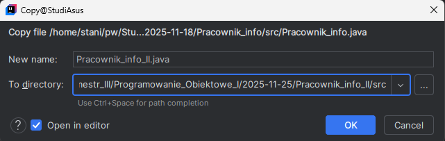
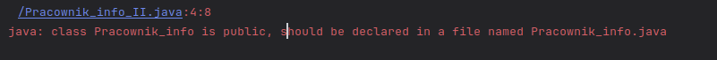
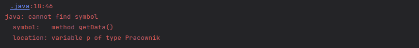
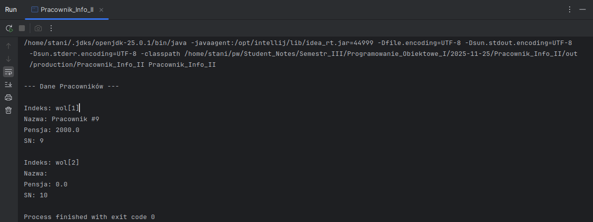
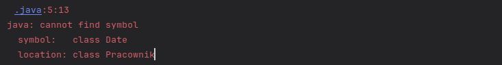

## <center>Sprawozdanie z zajęć komputerowych: <br> Programowanie Obiektowe I <center>

## <center>2025-11-25, Płock, Jakub Staniszewski, Grupa II<center>

### **Wstęp - Cel zajęć:**

- **Dalsza praca w środowisku `IntelliJ IDEA` (Java):**
    1.  Rozdzielenie definicji klas na osobne pliki (`.java`).
    2.  Wykorzystanie bloku statycznego oraz bloku inicjalizacyjnego instancji.
    3.  Zastosowanie przeciążania konstruktorów (użycie słowa kluczowego `this`).
    4.  Dostosowanie głównego pliku.

---

### **Przebieg zajęć:**

#### 1. **Nowy projekt Pracownik\_INFO\_II**

#### 1.1. Kopia poprzedniego kodu:

- PPM + Refactor \> Copy Class... lub F5<br>


#### 1.2. Sprawdzenie działania kodu (Błąd [E1])


#### 1.3. Podział na pliki

- Utworzenie pliku `Pracownik.java`
    - Kopiowanie do niego bloku `class Pracownik{...`

#### 1.4. Kod kompiluje się poprawnie.

-----

#### 2. **Zmiana pól w `Pracownik.java`**

#### 2.1. Zmiana bibliotek na:

```java
import java.util.*;
```

#### 2.2. Utworzono elementy statyczne:

```java
    // Pole statyczne [M1]
    public static int ni;

    // Blok statyczny (uruchamiany przy ładowaniu klasy) [M2]
    static{
        Random r = new Random();
        ni = r.nextInt(10); // losuje wartość 0-10
    }
```

#### 2.3. Korekta pozostałych pól:

```java
    // Pola instancji [M3]
    private int sn;
    private String nazwa = "";
    private double pensja;

    // Inicjalizacja instancji [M4]
    {
        sn = ni;
        ni++;
    }
```

---

#### 3. **Modyfikacje konstruktorów oraz metod w `Pracownik.java`**

#### 3.1. Wprowadzenie przeciążenia:

```java
    // Główny konstruktor po modyfikacji [M5]
    public Pracownik(String n, double p){
        this.nazwa = n;
        this.pensja = p;
    }

    // Drugi do "przeciążenia" [M6]
    public Pracownik(double p){
        this("Pracownik #" + ni, p);
    }

    // Trzeci jako konstruktor bezargumentowy [M7]
    public Pracownik(){
    }
```

#### 3.2. Dostosowanie metod do reszty kodu:

```java
    // --Metody-- [M8]
    public String getNazwa(){
        return nazwa;
    }
    public int getSN(){
        return sn;
    }
    public double getPensja() {
        return pensja;
    }
```

---

#### 4. **Dostosowanie `Pracownik_Info_II.java`:**

#### 4.1. Dla każdego z konstruktorów utworzono instancje klasy

```java
        Pracownik[] wol = new Pracownik[3];
        wol[0] = new Pracownik("Prezydent", 15000.0);
        wol[1] = new Pracownik(2000.0);
        wol[2] = new Pracownik(); 
```

#### 4.2. Sprawdzenie (Błąd [E2]):



  - Brak zmodyfikowanej pętli do wyświetlania.

#### 4.3. Zmieniono getData() na getSn() (Błąd - literówka [E3]):


#### 4.4 Brak 0-wego pracownika w wyjściu programu (Błąd wizualny [E4])
 <br>
- Rozwiązanie przez zmianę pętli 
    - `for (int p = 1; p <= 2; p++)`<br> 
    - na `for (Pracownik p : wol)`

---

### **Podsumowanie - Wnioski:**

1.  **Refactor**

      - Jeżeli kopiowany plik zawiera definicje kilku klas:
          - Należy wskazać docelową lokalizację dla kopii (patrz [punkt 1.1.](#11-kopia-poprzedniego-kodu)),
      - Zmiana nazwy pliku nie zmienia nazwy klasy wewnątrz kodu:
          - Trzeba robić to ręcznie, nawet przy użyciu opcji *Copy*.

2.  **Kopiowanie kodu z zewnątrz (np. notatnik)**

      - Importy nie są automatycznie kopiowane jak w `IntelliJ`, co skutkuje błędem [5]:<br>
      

3.  **Statyka i instancja**

      - Stan pola statycznego jest niezależny od liczby utworzonych pracowników [`[M1]`](#22-utworzono-elementy-statyczne),
      - Baza licznika jest losowana jednorazowo przy starcie programu [`[M2]`](#22-utworzono-elementy-statyczne),
      - Aby izolować dostęp między polami klas, są one typu `private` [`[M3]`](#23-korekta-pozostałych-pól),
      - Blok instancji [`[M4]`](#23-korekta-pozostałych-pól) gwarantuje niepowtarzalny SN dla każdego obiektu.

4.  **Konstruktory**

      - Mogą przypisywać dane podczas tworzenia instancji [`[M5]`](#31-wprowadzenie-przeciążenia),
      - Użycie `this(...)` eliminuje powtarzalność kodu i pozwala na przypisanie wartości domyślnych [`[M6]`](#31-wprowadzenie-przeciążenia),
      - Mogą działać bez podawania argumentów [`[M7]`](#31-wprowadzenie-przeciążenia).

5.  **Interfejs klasy**

      - Słowo kluczowe `public` przed metodą udostępnia ją innym klasom (tworzy interfejs publiczny) [`[M8]`](#32-dostosowanie-metod-do-reszty-kodu).

6.  **Wielkość liter**

      - Java rozróżnia wielkość liter – literówka w nazwie metody jest traktowana jako brak tej metody.

7.  **Pętle**

      - Aby unikać błędów indeksowania (np. wyjście poza zakres), bezpieczniej stosować pętlę `for-each`.