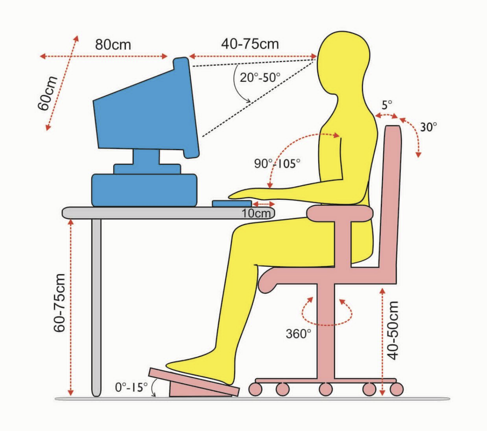

## **1. System ergonomiczny**

| Element           | Opis                                                             |
| ----------------- | ---------------------------------------------------------------- |
| Człowiek          | Operator, pracownik wykonujący zadania w systemie.               |
| Obiekt techniczny | Narzędzia, maszyny, urządzenia używane przez człowieka.          |
| Środowisko pracy  | Warunki fizyczne, chemiczne, psychiczne otaczające system pracy. |
| Organizacja pracy | Zasady, procedury, sposoby organizacji działań w systemie.       |

## **2. Projektowanie ergonomiczne**

"Pracodawca - przed dokonaniem wyboru maszyny na
dane stanowisko pracy - może skonsultować się z inspektorem BHP, który po
przeanalizowaniu parametrów, doradzi lub odradzi zakup."

| Etap                 | Opis                                                  |
| -------------------- | ----------------------------------------------------- |
| Analiza wymagań      | Identyfikacja potrzeb użytkownika i środowiska pracy. |
| Dobór rozwiązań      | Wybór odpowiednich technologii, narzędzi i rozwiązań. |
| Weryfikacja projektu | Testowanie ergonomiczności projektu.                  |
| Implementacja        | Wdrożenie ergonomicznych rozwiązań w praktyce.        |
| Ocena użytkowania    | Sprawdzanie efektywności i wygody w użytkowaniu.      |

## **3. Wymiary stanowiska komputerowego**

### 

### **Wymiary**

| Element                    | Zalecenia ergonomiczne                                                          |
| -------------------------- | ------------------------------------------------------------------------------- |
| Wysokość biurka            | 72-75 cm dla osoby o średnim wzroście, biurko stałe.                            |
| Wymiary blatu              | Co najmniej 100 x 80 cm.                                                        |
| Regulacja wysokości biurka | W zakresie od 55 do 120 cm, umożliwiająca pracę w pozycji siedzącej i stojącej. |
| Kolor blatu                | Jasny, aby minimalizować odbicia światła.                                       |
| Brzegi blatu               | Zaokrąglone dla bezpieczeństwa i komfortu.                                      |
| Odległość oczu od monitora | 40-75 cm.                                                                       |
| Kąt nachylenia monitora    | 10-20 stopni w dół.                                                             |
| Podpórka na nadgarstki     | Zapewnienie naturalnego ułożenia rąk.                                           |

### **Krzesło biurowe**

| Element                           | Zalecenia                                                                           |
| --------------------------------- | ----------------------------------------------------------------------------------- |
| Regulacja wysokości siedziska     | Zakres od 40 do 50 cm.                                                              |
| Oparcie                           | Wyprofilowane odpowiednio do lordozy lędźwiowej.                                    |
| Regulacja wysokości oparcia       | Zakres co najmniej 5-7 cm.                                                          |
| Regulacja kąta nachylenia oparcia | Zwykle od 90 do 110 stopni od płyty siedziska.                                      |
| Podłokietniki                     | Sięgające od oparcia do połowy siedziska, aby umożliwić przysunięcie się do biurka. |
| Regulacja podłokietników          | Wysokość i odległość między podłokietnikami powinny być regulowane.                 |
| Podnóżki                          | o wymiarach co najmniej 45 x 35 cm oraz kąt regulacji w zakresie 5-15°.             |

## **4. Cykl życia obiektu technicznego**

| Faza          | Opis                                           |
| ------------- | ---------------------------------------------- |
| Projektowanie | Tworzenie koncepcji i szczegółów technicznych. |
| Produkcja     | Wytwarzanie obiektu technicznego.              |
| Eksploatacja  | Użytkowanie w docelowym środowisku.            |
| Konserwacja   | Utrzymanie i naprawy techniczne.               |
| Utylizacja    | Wycofanie z użycia, recykling lub zniszczenie. |

##  **5. Ciężary jakie mogą przenosić mężczyźni i kobiety + 6. Praca dorywcza**

| Pracownik                  | Praca stała (kg) | Praca dorywcza (do 4 razy na godzinę) (kg) |
| -------------------------- | ---------------- | ------------------------------------------ |
| Kobiety                    | 12               | 20                                         |
| **Kobiety w ciąży**        | **0**            | **0**                                      |
| Mężczyźni                  | 30               | 50                                         |
| Dziewczęta (16–18 lat)     | 8                | 14                                         |
| Chłopcy (16–18 lat)        | 12               | 20                                         |
| Praca zespołowa            | 25               | 42                                         |

Kobiety w ciąży są objęte szczególnymi przepisami bezpieczeństwa i higieny pracy, 
dlatego zazwyczaj nie powinny wykonywać pracy wymagającej dźwigania ciężarów. 

## **7. Wydatek energetyczny dla kobiet/mężczyzn**

| Pracownicy | Wydatek energetyczny na zmianę roboczą |
| ---------- | -------------------------------------- |
| Mężczyźni  | ok. 3000-3500 kcal dla pracy ciężkiej  |
| Kobiety    | ok. 2000-2500 kcal dla pracy ciężkiej  |

## **8. Podział pracy ze względu na wydatek energetyczny**

| Stopień ciężkości pracy | Wartość wydatku na zmianę roboczą, kJ |
| ----------------------- | ------------------------------------- |
| Lekka                   | Kobiety: do 3 700                     |
|                         | Mężczyźni: do 6 300                   |
| Ciężka                  | Kobiety: 3 700 – 5 000                |
|                         | Mężczyźni: 6 300 – 8 400              |
| Bardzo ciężka           | Kobiety: powyżej 5 000                |
|                         | Mężczyźni: powyżej 8 400              |

## **9. Badania, ocena wydatku energetycznego**

| **Rodzaj metody** | **Metody**                                                |
|-------------------|-----------------------------------------------------------|
| Obiektywne        | - kalorymetrii bezpośredniej i pośredniej                 |
|                   | - detekcji i rejestracji ruchu                            |
|                   | - fizjologiczne                                           |
| Subiektywne       | - metody chronometrażowo-tabelaryczne (kwestionariuszowe) |
|                   | - metody ankietowe                                        |

## **10. Obciążenie psychiczne pracą**

| Typ obciążenia          | Opis                                       |
| ----------------------- | ------------------------------------------ |
| Obciążenie informacyjne | Nadmiar informacji do przetworzenia.       |
| Obciążenie decyzyjne    | Konieczność podejmowania licznych decyzji. |
| Obciążenie emocjonalne  | Stres wynikający z pracy.                  |

### **Objawy zmęczenia fizycznego i psychicznego**

| Zmęczenie fizyczne charakteryzują następujące objawy:                        | Zmęczenie psychiczne charakteryzują następujące objawy:                          |
| ---------------------------------------------------------------------------- | -------------------------------------------------------------------------------- |
| zmiany w układzie biochemicznym mięśnia                                    | zmniejszenie stopnia koncentracji                                              |
| wzrost produktów przemiany materii                                         | utrudnione myślenie                                                            |
| wyczerpanie zapasów energetycznych organizmu (m.in. pojawienie się długu tlenowego) | spowolnienie i osłabienie postrzegania                                        |
| pocenie się (odwodnienie organizmu, utrata elektrolitów, co znacznie przyspiesza rozwój zmęczenia) | spadek motywacji                                                              |
| pogorszenie koordynacji ruchowo-wzrokowej (spowolnienie ruchów, spadek sił mięśni i dokładności ruchu) | zaburzenia emocjonalne (apatia lub rozdrażnienie)                             |
| spadek wydajności (wzrost liczby błędów, czasu reakcji)                    | nastawienie systemu nerwowego na odpoczynek (ziewanie, senność)               |
| wzrost zagrożenia urazowego czy wypadkowego                                | spadek wydajności pracy (wzrost: tR, liczby błędów)                           |
|                                                                              | spadek formy fizycznej, energii organizacyjnej                                |
|                                                                              | wzrost zachorowań, urazów i wypadków                                          |

### **Charakterystyczne objawy występujące w przypadku monotonii i zmęczenia** 

| **Monotonii**                       | **Zmęczenia**                                   |
|-------------------------------------|-------------------------------------------------|
| Falisty przebieg zdolności do pracy | Stopniowe wyczerpywanie zasobów wydolnościowych |
| Spadek napięcia uwagi               | Wzrost napięcia psychicznego                    |
| Spadek tonusu mięśni                | Wzrost tonusu mięśni                            |
| Spadek ciśnienia skurczowego krwi   | Wzrost ciśnienia skurczowego krwi               |
| Spadek częstotliwości tętna         | Wzrost częstotliwości tętna                     |
| Spadek zużycia energii i O₂         | Wzrost zużycia energii                          |

## **11. Monotoniczność, monotypowość pracy**

| Kryterium                         | Opis                                                                                   |
| --------------------------------- | ------------------------------------------------------------------------------------- |
| Niezmienność procesu pracy        | Jednostajność i brak różnorodności w wykonywanych zadaniach.                          |
| Niezmienność otaczających warunków| Stałość środowiska pracy, brak zmian w otoczeniu.                                     |
| Stałe zachowanie uwagi            | Konieczność skupienia się na jednym zadaniu bez możliwości kontaktu z innymi osobami. |
| Łatwość pracy                     | Praca niewymagająca intensywnych procesów intelektualnych.                            |

### **Poziomy monotonii:**

| Poziom monotonii | Warunki występowania                                      |
| ---------------- | --------------------------------------------------------- |
| Duża             | Występują jednocześnie wszystkie wymienione okoliczności. |
| Średnia          | Występują jednocześnie trzy z wymienionych okoliczności.  |
| Mała             | Występują dwie z wymienionych okoliczności.               |

| **Monotypia**           | Wykonywanie prac powtarzalnych z jednostronnym przeciążeniem pewnych grup mięśniowych.            |
| ----------------------- | ------------------------------------------------------------------------------------------------- |
| **Monotypowość ruchów** | Powtarzanie tych samych czynności, w krótkim okresie czasu przy udziale tylko pewnych grup mięśni, co powoduje ich szybkie zmęczenie.

## **12. Bodźce słuchowe, dotykowe, czas reakcji**

| Element         | Zakres             | Opis                                         |
| --------------- | ------------------ | -------------------------------------------- |
| Bodźce zwrokowe | 0,16-0,26 sekundy. | Dostrzeżenie zagrożenia.                     |
| Bodźce dotykowe | 0,16-0,21 sekundy. | Wrażliwość na nacisk, temperaturę, wibracje. |
| => Czas reakcji | 0,2-0,3 sekundy    | Średnio u osoby dorosłej.                    |
| Bodźce słuchowe | 20 Hz - 20 kHz.    | Odbiór dźwięków w zakresie                   |

## **13. Hałas, zakres słyszalności**

| **Rodzaj hałasu**                   | **Zakres częstotliwości**       | **Opis**                                                                           |
|-------------------------------------|---------------------------------|------------------------------------------------------------------------------------|
| **Hałas infradźwiękowy**            | od 1 do 20 Hz                   | Składowe o częstotliwościach infradźwiękowych                                      |
| **Hałas słyszalny**                 | od 20 do 20000 Hz               | Składowe o częstotliwościach słyszalnych                                           |
| **Hałas ultradźwiękowy**            | od 10 kHz do 40 kHz             | Składowe o wysokich częstotliwościach słyszalnych i niskich ultradźwiękowych       |
| **Maksymalny hałas długotrwały**    | 80-85 dB (NDN)                  | Poziom ekspozycji na hałas zarówno podczas 8-godzinnej pracy, jak i tygodnia pracy |
| **Maksymalny hałas impulsowy**      | 120 dB                          |                                                                                    |
| **Dla szczytowego poziomu dźwięku** | 135 dB                          | **Nie może być przekraczany**                                                      |

**13. Ilość informacji do zapamiętania za jednym razem**

| Rodzaj informacji                | Maksymalna ilość informacji do zapamiętania |
| -------------------------------- | ------------------------------------------- |
| Proste fakty (np. liczby, słowa) | 5-9 elementów                               |
| Sekwencje (np. kroki procedury)  | 3-5 kroków                                  |
| Złożone informacje (np. schematy)| 2-4 elementy                                |
| Informacje wizualne              | Do 3-5 elementów                            |
| Informacje abstrakcyjne          | 1-3 elementy                                |

## **15. Stężenia substancji chemicznych (NDS, NDSP, NDSCh)**

| Skrót   | Znaczenie                                  | Opis                                                                                                     |
| -------- | ----------------------------------------- | -------------------------------------------------------------------------------------------------------- |
| **NDS**  | Najwyższe Dopuszczalne Stężenie           | Średnie stężenie substancji chemicznej, które nie powoduje negatywnego wpływu na zdrowie pracownika w trakcie 8-godzinnego dnia pracy. |
| **NDSP** | Najwyższe dopuszczalne stężenie pułapowe | Maksymalne stężenie, które nie może być przekroczone w żadnym momencie pracy, nawet na bardzo krótki czas. |
| **NDSCh**| Najwyższe Dopuszczalne Stężenie Chwilowe  | Stężenie, które może wystąpić przez krótki okres (do 15 minut), nie częściej niż 2 razy w ciągu zmiany roboczej, wtedy bez negatywnego wpływu na zdrowie pracownika. |