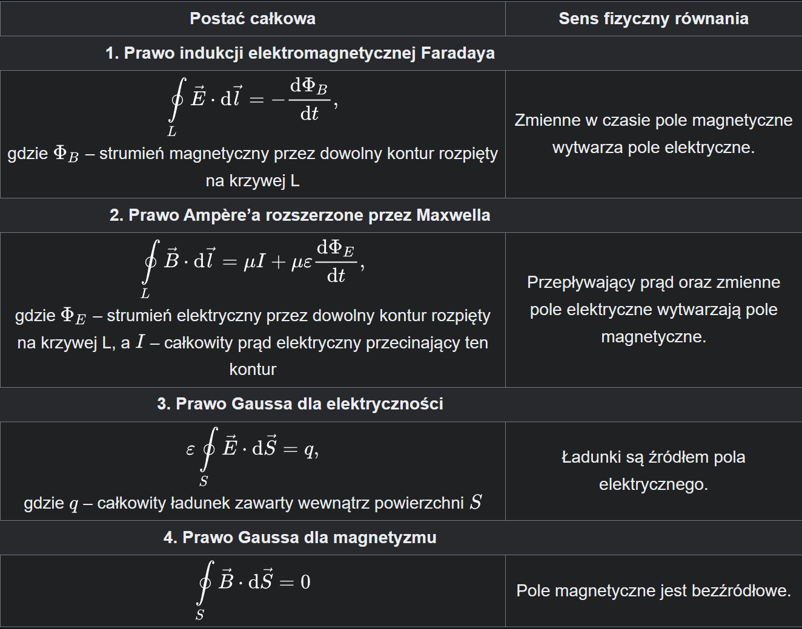

## 1. Obwód prądu stałego – Prawa Kirchhoffa

| **Zagadnienie**              | **Opis**                                                                 | **Wzór**                                  | Warunek
|------------------------------|--------------------------------------------------------------------------|-------------------------------------------|---------|
| **Pierwsze prawo Kirchhoffa** | Suma prądów wpływających do węzła równa się sumie prądów wypływających. | I1+I2=I3, | Prądy I1+I2 są wpływają do węzła, z którego wypływa I3 |
| **Drugie prawo Kirchhoffa**   | Suma napięć w obwodzie zamkniętym (oczku) wynosi zero.                  | U-R⋅I=0              | |
| **Bilans mocy**               | Całkowita moc pobrana przez odbiorniki równa jest mocy dostarczanej.    | (R⋅I2) = (U⋅I) | | 

## 2. Równania Maxwella:  

- źródło https://pl.wikipedia.org/wiki/Równania_Maxwella

| **Zasada**                           | **Opis**                                                                                    | **Zastosowanie**           |
|--------------------------------------|---------------------------------------------------------------------------------------------|----------------------------|
| **Prawo Faradaya**                   | Zmieniające się pole magnetyczne indukuje prąd elektryczny w przewodniku.                     | Zasada działania prądnic, transformatorów, systemów bezprzewodowego ładowania.                       |
| **Prawo Ampère’a-Maxwella**          | Prądy i zmienne pole elektryczne generują pole magnetyczne.                     | Wyjaśnia powstawanie fal elektromagnetycznych, stosowane w antenach i komunikacji radiowej.                   | 
| **Prawo Gaussa dla elektryczności**  | Strumień pola elektrycznego przez zamkniętą powierzchnię jest proporcjonalny do ładunku wewnątrz tej powierzchni.     | Obliczanie rozkładu pola elektrycznego w otoczeniu ładunków, np. w kondensatorach czy kablach.       |
| **Prawo Gaussa dla magnetyzmu**      | Nie istnieją magnetyczne monopole; linie pola magnetycznego są zawsze zamknięte.                       | Opisuje brak magnetycznych monopoli; stosowane w projektowaniu urządzeń magnetycznych i cewek.       |

## 3. Tranzystor MOSFET 

| Cecha | Opis |
|---|---|
| **Definicja** | Tranzystor polowy efektu pola, element półprzewodnikowy sterowany napięciem, służący do wzmacniania lub przełączania sygnałów elektrycznych. |
| **Budowa** | Składa się z trzech elektrod: bramki, źródła i drenu. Między źródłem a drenem znajduje się kanał, którego przewodnictwo jest kontrolowane przez napięcie na bramce. |
| **Zasada działania** | Zmiana napięcia na bramce powoduje zmianę przewodnictwa kanału, co wpływa na prąd płynący między źródłem a drenem. |
| **Rodzaje** |  * **n-kanałowe:** Przewodzą prąd, gdy na bramce jest dodatnie napięcie.   * **p-kanałowe:** Przewodzą prąd, gdy na bramce jest ujemne napięcie.   * **Z wbudowanym kanałem:** Kanał przewodzący istnieje nawet przy zerowym napięciu na bramce.   * **Z indukowanym kanałem:** Kanał powstaje dopiero po przyłożeniu odpowiedniego napięcia na bramkę. |
| **Zastosowania** |  * **Przełączniki:** W układach cyfrowych do tworzenia logicznych bram.   * **Wzmacniacze:** W układach analogowych do wzmacniania sygnałów.   * **Sterowniki:** Do sterowania silnikami, oświetleniem, itp.   * **Układy scalone:** Jako podstawowy element w układach scalonych. |
| **Zalety** | Wysoka impedancja wejściowa, duża szybkość działania, możliwość miniaturyzacji. |
| **Wady** | Wrażliwość na ładunki elektrostatyczne, efekt kanału krótkiego przy wysokich częstotliwościach. |

**W skrócie:** Tranzystor MOSFET to kluczowy element elektroniki, który pozwala na sterowanie prądem za pomocą napięcia. Jego działanie opiera się na modulacji przewodnictwa kanału przez pole elektryczne utworzone na bramce.

## 4. Efekt Halla

**Zjawisko Halla** to fizyczne zjawisko polegające na wystąpieniu różnicy potencjałów elektrycznych (napięcie Halla) w poprzek przewodnika, przez który płynie prąd elektryczny, gdy przewodnik znajduje się w poprzecznym do płynącego prądu polu magnetycznym.

| Cecha | Opis |
|---|---|
| **Definicja** | Wystąpienie różnicy potencjałów w przewodniku, w którym płynie prąd elektryczny, gdy znajduje się on w polu magnetycznym prostopadłym do kierunku prądu. |
| **Przyczyna** | Siła Lorentza działająca na nośniki ładunku w polu magnetycznym powoduje ich odchylenie, co prowadzi do powstania różnicy potencjałów. |
| **Napięcie Halla** | Różnica potencjałów powstająca w poprzek przewodnika w wyniku działania siły Lorentza. |
| **Znak napięcia Halla** | Zależy od rodzaju nośników ładunku (elektronów lub dziur). |
| **Czynniki wpływające na napięcie Halla** | Natężenie prądu, indukcja magnetyczna, grubość próbki, rodzaj materiału. |
| **Zastosowania** | Pomiar indukcji magnetycznej, pomiar natężenia prądu, określenie typu nośników ładunku, czujniki położenia, czujniki prądu. |
| **Zalety czujników Halla** | Bezkontaktowy pomiar, wysoka dokładność, szybki czas odpowiedzi, miniaturyzacja. |
| **Ograniczenia** | Wrażliwość na temperaturę, efekty nieliniowe przy dużych polach magnetycznych. |

### Szczegółowe wyjaśnienie niektórych pojęć:

* **Siła Lorentza:** To siła działająca na naładowaną cząstkę poruszającą się w polu magnetycznym. Kierunek siły Lorentza jest prostopadły zarówno do kierunku ruchu cząstki, jak i do kierunku pola magnetycznego.
* **Nośniki ładunku:** W metalach nośnikami ładunku są zazwyczaj elektrony, natomiast w półprzewodnikach mogą być zarówno elektrony, jak i dziury.
* **Czujnik Halla:** Urządzenie wykorzystujące efekt Halla do pomiaru różnych wielkości fizycznych, takich jak natężenie pola magnetycznego, natężenie prądu czy położenie.

### Dodatkowe informacje:

* **Efekt Halla kwantowy:** Obserwowany w bardzo niskich temperaturach i silnych polach magnetycznych, gdzie przewodnictwo elektryczne przyjmuje skwantowane wartości.
* **Zastosowania w elektronice:** Czujniki Halla są wykorzystywane w różnego rodzaju układach elektronicznych, np. w czujnikach położenia w silnikach elektrycznych, czujnikach prądu w zasilaczach, a także w układach zabezpieczających.

## 5. Model pasmowy przewodnictwa

| Cecha | Opis | Wpływ na przewodnictwo |
|---|---|---|
| **Definicja** | Zakres energii, jakie mogą zajmować elektrony walencyjne w materiale. | Im szersze pasmo, tym większa możliwość ruchu elektronów. |
| **Położenie względem pasma przewodnictwa** | Oddzielone od pasma przewodnictwa przerwą energetyczną. | Im mniejsza przerwa, tym łatwiej elektronom przeskoczyć do pasma przewodnictwa i tym większe przewodnictwo. |
| **Zależność od temperatury** | Zwiększenie temperatury powoduje wzrost energii drgań cieplnych atomów, co może prowadzić do rozszerzenia pasma walencyjnego i zwiększenia prawdopodobieństwa przejścia elektronów do pasma przewodnictwa. | W półprzewodnikach wzrost temperatury zwiększa przewodnictwo. |
| **Wpływ domieszkowania** | Wprowadzenie atomów domieszkowych może tworzyć dodatkowe poziomy energetyczne w przerwie energetycznej, co wpływa na położenie poziomu Fermiego i przewodnictwo. | Dopałowanie półprzewodników pozwala na precyzyjną kontrolę ich właściwości elektrycznych. |
| **Rola w wiązaniu chemicznym** | Elektrony walencyjne uczestniczą w tworzeniu wiązań chemicznych między atomami. | Siła wiązań chemicznych wpływa na szerokość pasma walencyjnego i przerwy energetycznej. |
| **Zastosowanie w elektronice** | Właściwości pasma walencyjnego są kluczowe dla działania urządzeń elektronicznych, takich jak tranzystory, diody i układy scalone. | Dzięki zrozumieniu pasma walencyjnego można projektować nowe materiały i urządzenia elektroniczne. |

## 6. Nadprzewodnictwo 

| Cecha | Opis |
|---|---|
| **Definicja** | Zjawisko całkowitego zaniku oporu elektrycznego w niektórych materiałach poniżej określonej temperatury krytycznej. |
| **Temperatura krytyczna (Tc)** | Temperatura, poniżej której materiał staje się nadprzewodnikiem. |
| **Efekt Meissnera** | Wypychanie pola magnetycznego z wnętrza nadprzewodnika. Gdy materiał przechodzi w stan nadprzewodzący, indukowane są w nim prądy powierzchniowe, które wytwarzają pole magnetyczne o przeciwnym kierunku do zewnętrznego pola, co prowadzi do całkowitego wygaszenia pola wewnątrz nadprzewodnika. |
| **Pary Coopera** | Elektrony tworzące pary, które poruszają się przez materiał bez rozpraszania. |
| **Zastosowania** | Magnesy nadprzewodzące, przewody energetyczne, elektronika, medycyna. |
| **Zalety** | Zerowy opór elektryczny, silne pola magnetyczne. |
| **Wyzwania** | Niskie temperatury krytyczne, koszty, wrażliwość na pola magnetyczne. |
| **Materiały nadprzewodzące** | Metale (np. ołów, rtęć), stopy (np. niob-tytan), ceramiki (np. YBCO). |
| **Teorie nadprzewodnictwa** | Teoria BCS (Bardeen-Cooper-Schrieffer) dla konwencjonalnych nadprzewodników, teorie dla nadprzewodników wysokotemperaturowych (jeszcze nie w pełni wyjaśnione). |